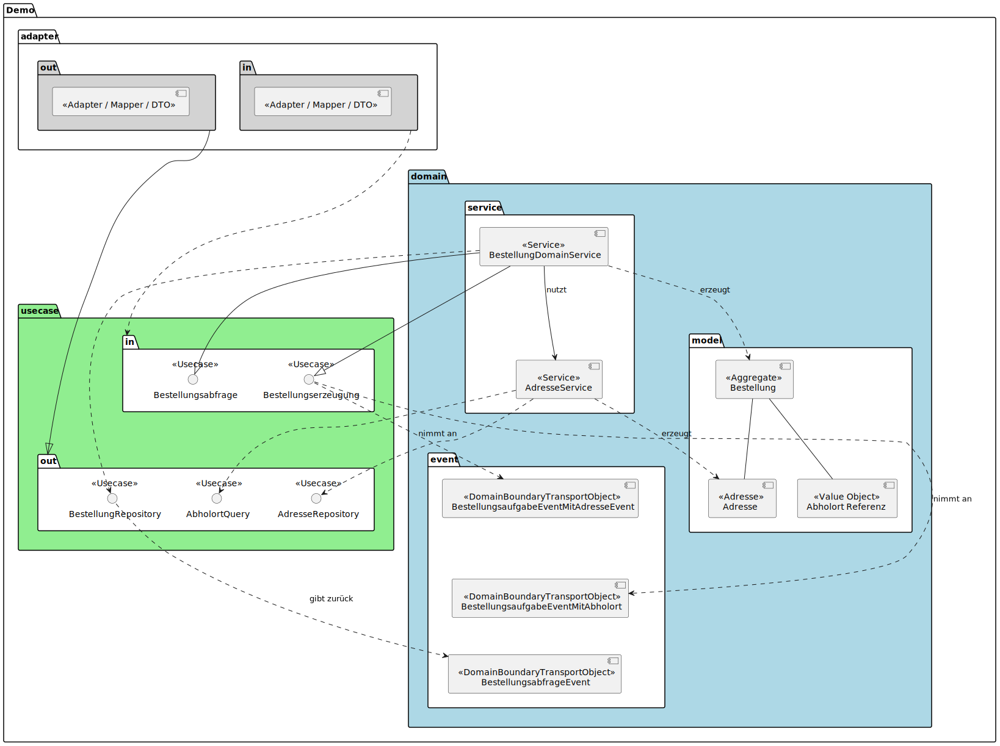
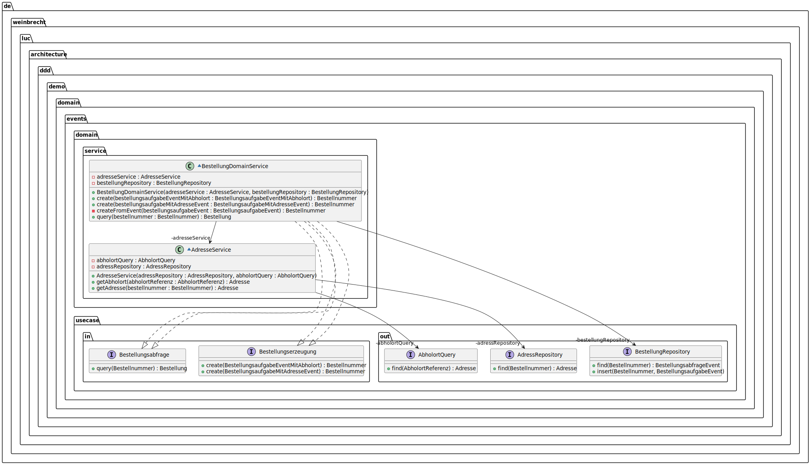

# DDD With Domain Events Demo

## 📌 Problemstellung

Es gibt Fachdomänen – z. B. im E-Commerce – in denen Objekte wie die **Adressen**, je nach Kontext unterschiedlich behandelt werden sollte:

* **Als Entity / Value Object**:
  Eine Adresse gehört nur zu einem Aggregat (Bestellung) und hat keinen eigenen Lebenszyklus.
  Beispiel: Rechnungsadresse eines Kunden.

* **Als Referenz auf eine Entity in einem anderen Bounded Context**:
  Eine Adresse wird zentral verwaltet und wiederverwendet.
  Beispiel: Versand an eine Packstation oder einen Pickup Point aus dem Logistik-Kontext.

Das Projekt zeigt anhand eines einfachen **E-Commerce-Szenarios**, wie eine **Bestellung** sowohl eine **ad-hoc Adresse (Entity / Value Object)** als auch eine **Referenz auf eine Logistik-Entität (Abholhort)** nutzen kann.

👉 **Ziel:** Verdeutlichen, wie DDD mithilfe von **Domain Events** für die Kommunikation zwischen Domänen sowie durch **Value Objects, Entities und Bounded Contexts** sauber zwischen unterschiedlichen Anforderungen an „Adressen“ differenziert.

💡 **Nebeneffekt**: Durch diese Implementierung wird die Adresse einer Bestellung automatisch lazy geladen – unabhängig davon, ob sie aus dem lokalen Aggregat oder über einen Adapter aus einem anderen Bounded Context stammt. Das sorgt für eine saubere Entkopplung und effiziente Ressourcennutzung.

## Bausteinsicht

Nachfolgend die Bausteinsicht, der einzelnen Elemente und deren Interaktionen.

### Bausteinsicht: Domänen Serivce / Kern isoliert

